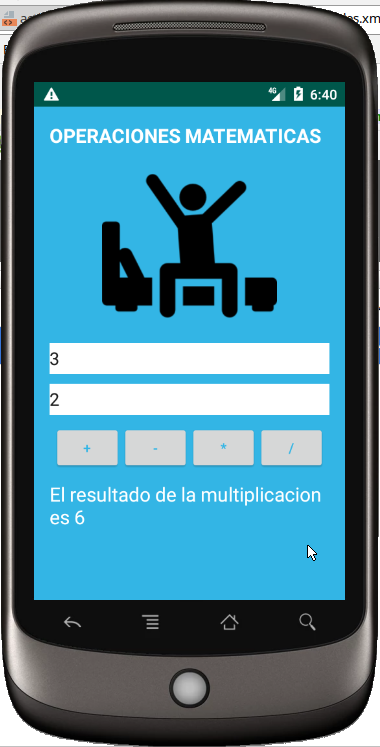

 # Operaciones Matematicas

Application named: ´com.pprios.operacionmatematica´
Simple application android with:

* Android Studio 3.2.1
* Gradle 4.6
* Kotlin 1.2.71-release-studio3.2-1

Creación de la interface inputs
Creación de eventos y funciones aritmeticas, reconociendo el lenguaje Java > kotlin on AndroidStudio

